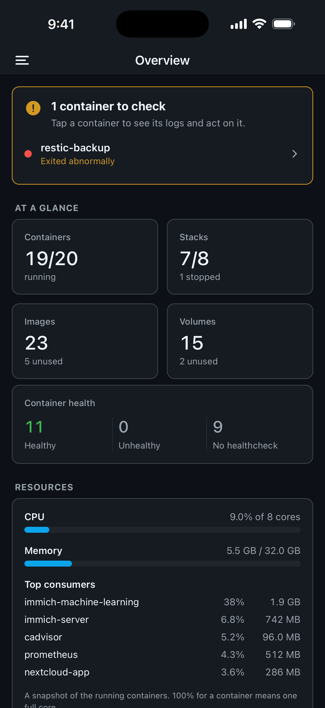
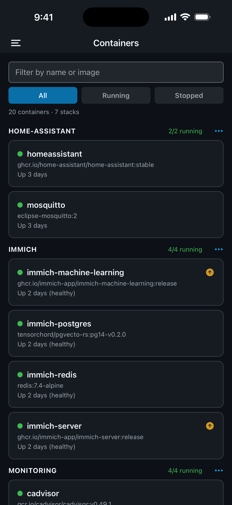
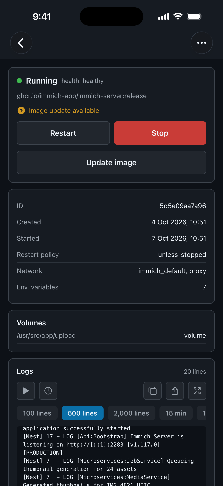
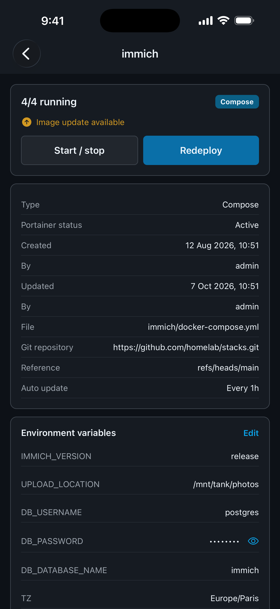

# StackPilot

**Your Portainer, in your pocket.** StackPilot is a mobile app for
[Portainer](https://www.portainer.io/) (Community and Business editions), on
iPhone, iPad and Android. Check on your Docker hosts, read logs and act on
containers and stacks from anywhere, without opening a laptop.

It talks directly to your Portainer instance: no StackPilot server, no account,
no tracking.

  
  
  
  

## Features

**See what needs attention.** Each environment opens on an overview: containers
that are unhealthy, stuck restarting or exited abnormally, running containers
and stacks, CPU and memory use with the heaviest containers, Docker disk usage
and pending image updates.

**Containers.** Browse them grouped by stack, search by name or image, filter
running or stopped ones. Start, stop, restart, pause, resume, kill or delete a
container, or update it to the latest version of its image. The list refreshes
on its own, at the interval you choose.

**Logs.** Read the last 100 to 2,000 lines, or everything from the last 15
minutes, hour or day. Follow them live, show timestamps, switch to full screen,
copy or share them.

**Stacks.** Compose and Swarm stacks managed by Portainer, and stacks deployed
outside it. Start or stop a whole stack, redeploy it (pulling the latest Git
commit or fresh images), edit its environment variables and read its Compose
file. Passwords, tokens and keys stay hidden until you reveal them.

**Images and volumes.** See which ones are in use and by which containers, how
much space they take and how much you can reclaim. Delete what is unused, or
clean up untagged images and orphaned volumes in one go, with a preview of what
goes.

**Alerts.** Get a push notification when a container crashes, turns unhealthy,
restarts or runs out of memory, through a small service you run next to
Portainer (see [Notifications](#notifications)).

**Careful by design.** Anything disruptive asks for confirmation, and deleting
a volume asks you to type its name. Every action runs with the permissions of
your Portainer user, nothing more.

## Requirements

- A Portainer instance (Community or Business Edition) your phone can reach:
  on your local network, through a VPN such as Tailscale or WireGuard, or over
  the Internet behind a reverse proxy.
- Docker standalone or Swarm environments. Kubernetes environments show up in
  the list but are not supported.
- iOS / iPadOS 16.4 or later, or Android 7.0 or later.
- Image update status needs Portainer Business, with the image update
  indicator turned on for the environment.

## Getting started

1. Install StackPilot from the App Store or Google Play.
2. In Portainer, open **My account › Access tokens › Add access token** and
   copy the token (`ptr_…`). Portainer shows it only once.
3. In StackPilot, enter your instance URL — for example
   `https://portainer.example.com` or `https://192.168.1.10:9443` — paste the
   token and tap **Sign in**.

The app opens on the overview of your first environment. The side menu
switches between environments and their containers, stacks, images and
volumes.

### Access token or password?

You can also sign in with your Portainer username and password. An access
token is the better choice for everyday use:

|                     | Access token                     | Username and password                        |
| ------------------- | -------------------------------- | -------------------------------------------- |
| Lifetime            | Until you revoke it in Portainer | A session that expires after a few hours     |
| Kept on your device | The token                        | A session token — never your password        |
| Revocation          | One token, from Portainer        | Change your password, or wait for the expiry |

Either way, credentials are kept in the iOS Keychain or the Android Keystore.

## HTTPS and self-signed certificates

StackPilot always verifies your instance's certificate. That means Portainer's
default self-signed certificate (port 9443) is refused by both iOS and
Android, and the app offers no switch to ignore it. Instead, give your phone a
certificate it trusts:

- **Tailscale** — `tailscale serve` provides a valid certificate, with no port
  to open.
- **A reverse proxy with Let's Encrypt** — Caddy, Traefik or Nginx Proxy
  Manager, if you have a domain name.
- **Your own certificate authority** — created with `mkcert` and installed on
  the phone. On Android, StackPilot trusts authorities you install yourself,
  which most apps don't.

Step-by-step instructions for each live in the app, under **Settings › HTTPS
certificate**, and on the sign-in screen when a connection fails.

Plain HTTP is not recommended: Android refuses it altogether, and iOS only
allows it on your local network.

## Notifications

A phone cannot watch a server: iOS and Android suspend apps in the background.
Alerts therefore come from **[portainer-watcher](watcher/)**, a tiny service
(one file, no dependencies) you run next to Portainer. It listens to Docker
events and pushes an alert when a container:

- exits with an error code,
- turns unhealthy,
- runs out of memory,
- restarts.

To set it up:

1. In StackPilot, open **Settings › Alerts for your containers**, allow
   notifications and copy this device's token.
2. Deploy the watcher with that token — see [its README](watcher/README.md).

Tapping an alert opens the container, its logs one tap away.

## Settings

- **Refresh**: every 10, 15 or 30 seconds, every minute, or manual (pull down
  to refresh).
- **Report a problem**: opens a GitHub issue pre-filled with the app version
  and your device model — nothing about your instance.
- **What's new**, terms of use and privacy policy.

## Privacy

StackPilot collects nothing. It has no server of its own, no analytics and no
ads: the app only talks to your Portainer instance, and to Expo's push service
if you turn notifications on. Your instance address, username, token and
settings stay in your device's secure keychain.

Full texts: [privacy policy](docs/legal/privacy.md) ·
[terms of use](docs/legal/terms.md).

## Known limitations

- Kubernetes environments are not supported.
- No interactive console (`exec`) and no network management yet.
- Starting or stopping a stack acts container by container, without following
  `depends_on`. When the start order matters, start the containers one by one.
  The action always covers the whole stack, even when a filter hides some of
  its containers.
- A container counts as using an image or a volume even when it is stopped,
  as in Portainer. An image only referenced by a stack that is not deployed
  shows as unused.
- Notification tokens are copied by hand into the watcher, and a device's
  token changes when the app is reinstalled.

## Feedback

Found a bug or have an idea? Use **Settings › Report a problem** in the app, or
[open an issue](https://github.com/altyx/stackpilot/issues).

## License

StackPilot is open source under the [MIT license](LICENSE).

StackPilot is an independent project, not affiliated with or endorsed by
Portainer.io or Docker, Inc. "Portainer" and "Docker" are trademarks of their
respective owners.
